# IcePredict — AI 예측과 RTOS 반응의 이중 안전망 블랙아이스 대응 시스템

**AI가 노면을 미리 보고, 못 보더라도 RTOS가 차량 거동으로 확실히 잡는다.**

제24회 임베디드SW경진대회 · 자동차/모빌리티(현대자동차) · 팀 ARTS

<p align="center">
  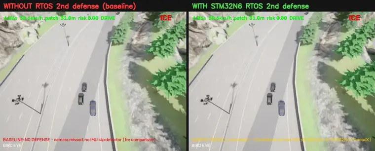
  <br>
  <sub><b>왼쪽</b> 방어가 없을 때 — 빙판에서 제어를 잃고 차체가 가로로 돌아간다. &nbsp;·&nbsp; <b>오른쪽</b> STM32N6 RTOS 2차 방어 — 미끄러짐을 잡아 차선 안에서 세운다. 같은 날씨, 같은 주행선, 같은 빙판.</sub>
</p>

---

## 왜 이중 방어인가

블랙아이스는 **공개 데이터에 라벨이 없다.** 투명한 얼음은 아스팔트와 시각적으로 구분되지 않는다는 것이 업계 통설이고, 실제로 우리 모델도 실사진 얼음 6,340장 중 248장(3.9 %)을 놓친다. 놓친 사진의 얼음 확률은 0.00~0.48이라 문턱을 낮춰도 잡히지 않는다.

그래서 카메라 하나에 기대지 않는다.

| | 1차 방어 · 예측 | 2차 방어 · 반응 |
|---|---|---|
| 센서 | 전방 카메라 | IMU (횡가속 · yaw rate · 종가속) |
| 판단 | 노면 4분류 + 반사도 + 기상 맥락 → 위험도 | 칼만 필터 + 자전거 모델 잔차 → 미끄러짐 확정 |
| 시점 | 빙판에 닿기 **전** | 미끄러지기 **시작한 뒤** |
| 성격 | 똑똑하지만 틀릴 수 있다 | 단순하지만 제때 반드시 실행된다 |
| 실행 | STM32N6 NPU, 25 ms | STM32N6 + ThreadX, 최악 22.6 µs |

두 방어가 **같은 보드 한 장**에서 돈다. 혼합 임계도 AI ECU 구조다.

<p align="center">
  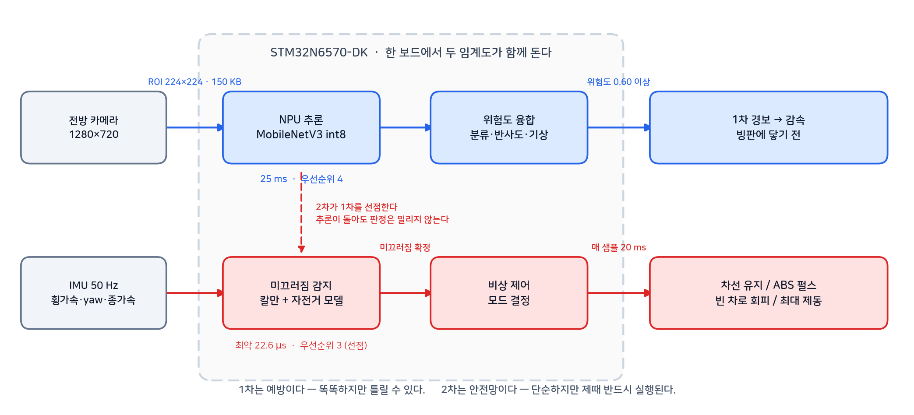
</p>

ThreadX 우선순위는 IMU 융합 스레드가 3, NPU 프레임 스레드가 4다. 25 ms짜리 추론이 돌고 있어도 IMU 판정이 선점한다.

---

## 하드웨어

<table>
<tr>
<td width="33%">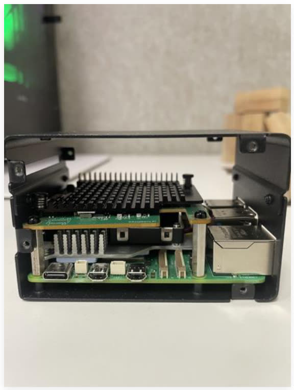</td>
<td width="33%">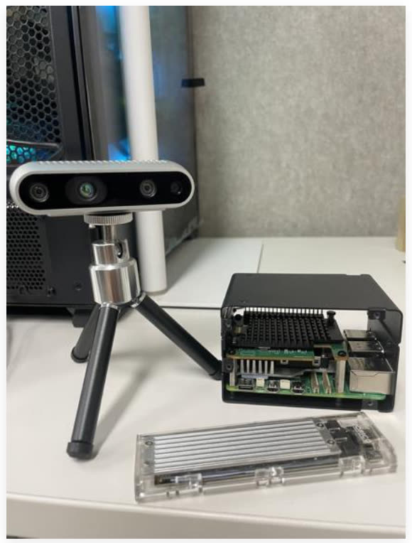</td>
<td width="33%">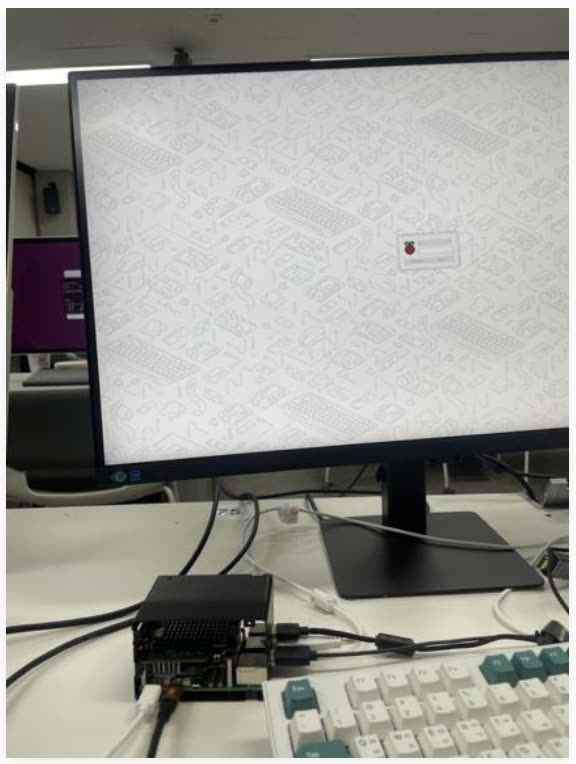</td>
</tr>
<tr>
<td align="center"><sub>Pi 5 16 GB + AI HAT+ 2 (Hailo-10H), KKSB 케이스·액티브 쿨러</sub></td>
<td align="center"><sub>RealSense D435i (RGB·뎁스·IMU) · NVMe 1 TB 외장</sub></td>
<td align="center"><sub>부팅·브링업 확인</sub></td>
</tr>
</table>

| 구성 | 역할 |
|---|---|
| **STM32N6570-DK** | 1차 NPU 추론(Neural-ART) + 2차 ThreadX 실시간 판정·제어. 두 임계도가 한 보드에 공존한다 |
| **Raspberry Pi 5 16 GB + AI HAT+ 2 (Hailo-10H)** | 호스트. 기상 맥락 생성, 통신 브리지, 교차 검증용 NPU |
| **RealSense D435i** | RGB·뎁스·IMU. 실측 노이즈 특성 확보용 |
| **RTX 5090 워크스테이션** | CARLA 시뮬레이션 (HIL 환경의 물리·센서 제공) |

실물 빙판 노면을 만드는 1/5 차량 실측이 현실적으로 어려워, **실물 보드가 실제 펌웨어를 돌리고 CARLA가 센서와 물리를 제공하는 HIL 검증**으로 대체했다. 실물 데이터는 RSCD 실사진 69,358장을 보드에 직접 넣는 방식으로 보강했다.

---

## 1차 방어 — 카메라가 보고 미리 선다

<p align="center">
  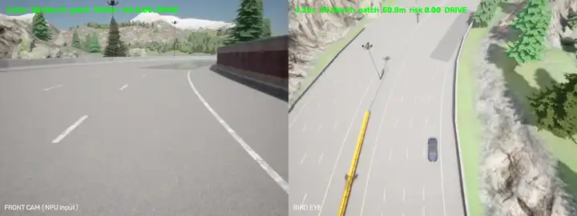
  <br>
  <sub>왼쪽은 모델이 실제로 보는 화면, 오른쪽은 조감. 빙판 24 m 앞에서 정지했다.</sub>
</p>

성능은 시뮬레이션 화면이 아니라 **실제 도로 사진 69,358장을 보드에 직접 넣어** 쟀다.

| 실제 노면 | 장수 | 정답률 | 경보율 (문턱 0.603) |
|---|---:|---:|---:|
| 블랙아이스 | 6,340 | **96.1 %** | **96.6 %** |
| 마른 노면 | 19,018 | 80.7 % | 0.3 % |
| 젖은 노면 | 34,440 | 84.6 % | 0.8 % |
| 포트홀 | 9,560 | 90.2 % | 0.3 % |

<p align="center">
  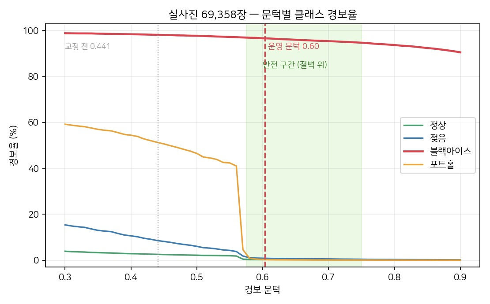
  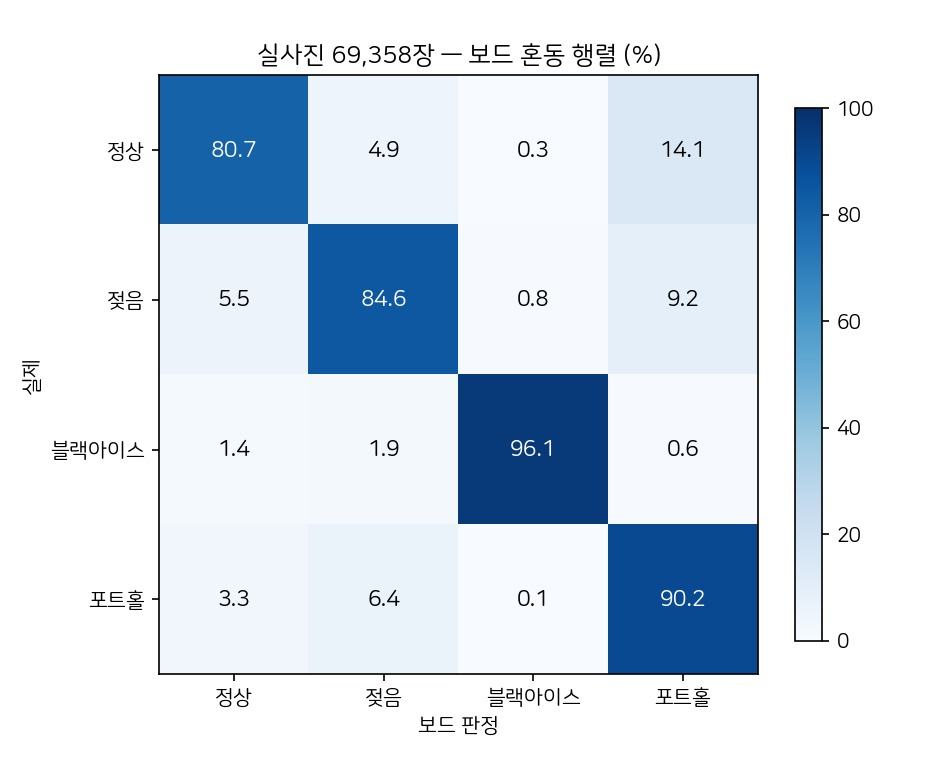
</p>

→ 근거: [`05_실사진_대규모평가`](docs/evidence/05_실사진_대규모평가.md) · [`02_융합가중치`](docs/evidence/02_융합가중치.md) · [`07_노면조건별_분해`](docs/evidence/07_노면조건별_분해.md)

---

## 2차 방어 — 못 봤을 때 보드가 받는다

<p align="center">
  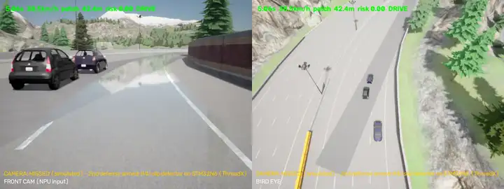
  <br>
  <sub>1차를 끈 채 빙판에 진입했다. 보드가 미끄러짐을 확정하고 차선을 유지하며 세운다. 주변 차량 8대와 정차 차량이 있는 상황.</sub>
</p>

**왜 리눅스가 아니라 RTOS인가.** 속도가 아니라 **꼬리**가 쟁점이다. 같은 연산을 Pi 5 리눅스가 평균 146배 빠르게 하지만, 최악 깨어남 지연이 5,790 µs다. 제어 주기 20 ms의 29 %를 한 번의 지터가 먹는다.

| 플랫폼 | 표본 | 중앙값 | 최악 |
|---|---:|---:|---:|
| Pi 5 + Linux · 유휴 | 20,000 | 69 µs | **5,790 µs** |
| Pi 5 + Linux · 부하 | 20,000 | 68 µs | **5,429 µs** |
| STM32N6 + ThreadX (응답 전체) | 49,405 | 12.4 µs | **22.6 µs** |

<p align="center">
  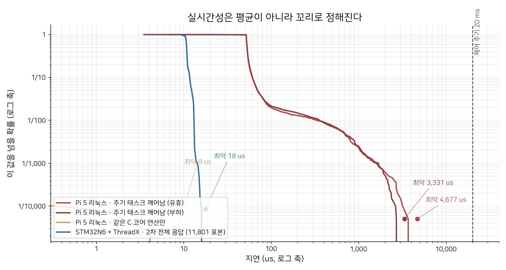
</p>

→ 근거: [`06_RTOS가_왜_필요한가`](docs/evidence/06_RTOS가_왜_필요한가.md) · [`10_스케줄가능성_분석`](docs/evidence/10_스케줄가능성_분석.md)

---

## 방어가 없으면

<p align="center">
  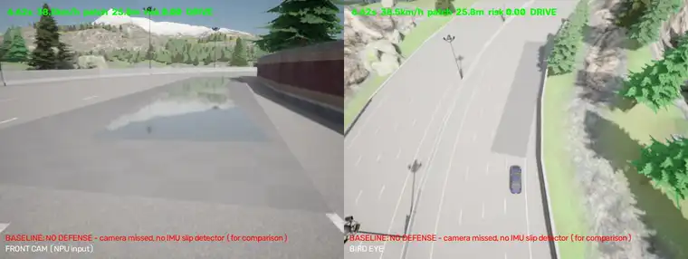
  <br>
  <sub>같은 빙판, 같은 속도. 1차·2차를 모두 끄면 빙판을 그대로 지나 차선을 벗어나고, 12.3초에 12 km/h로 방호벽에 부딪힌다. 왼쪽은 모델이 보는 화면, 오른쪽은 조감.</sub>
</p>

기준선 주행 **9건 전부 제어를 잃었다.** 9건 모두 차선을 벗어났고, 차체가 진행 방향과 **88~99° 어긋난 채** 가로로 미끄러졌다. 그중 5건은 12~17 km/h로 방호벽에 부딪혔고, 주변 차량이 있던 4건은 충돌 전에 미끄러짐으로 끝났다.

<sub>여기서 '스핀'은 차선 대비 방향 오차가 86°를 넘은 순간을 말한다. 실측값은 −88.4°에서 −99.2° 사이였다.</sub>

<sub><b>기준선의 가정.</b> 제어를 잃은 뒤에는 운전자 입력을 모형화하지 않는다. 비교 대상은 "우리 시스템이 개입하느냐"이지 "운전자가 얼마나 잘 대처하느냐"가 아니기 때문이다. 그래서 차선 이탈이 확정되면 자율주행을 떼고 관성에 맡기며, 정지하거나 충돌하거나 4초가 지나면 주행을 끝낸다.</sub>

### 2차 방어도 만능은 아니다

<p align="center">
  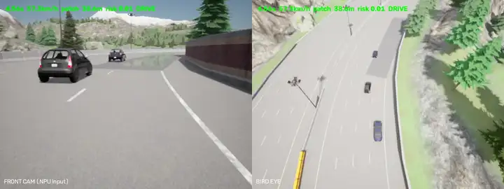
  <br>
  <sub>60 km/h. 카메라가 경고했지만 제동이 늦어 빙판에 진입했고, 보드가 제때 개입했는데도 앞차와 39 km/h로 충돌했다.</sub>
</p>

2차 방어는 **미끄러지기 시작한 뒤** 움직인다. 예방이 아니라 피해 최소화다. 그래서 1차가 필요하고, 1차가 보는 거리를 늘리는 것이 다음 과제다.

---

## 센서 시각화

<p align="center">
  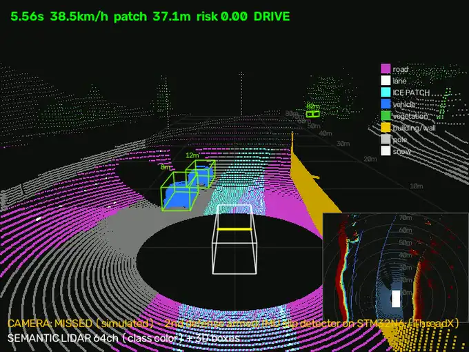
  <br>
  <sub>시맨틱 라이다 64채널. 청록이 빙판 구간, 초록 상자가 차량 3D 박스.</sub>
</p>

<p align="center">
  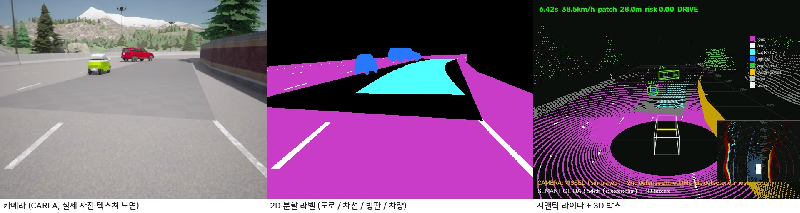
  <br>
  <sub>카메라 원본 · 2D 분할 라벨(도로/차선/빙판/차량) · 시맨틱 라이다. 라벨은 자동 생성한다.</sub>
</p>

### 날씨 11종에서 같은 순간

<p align="center">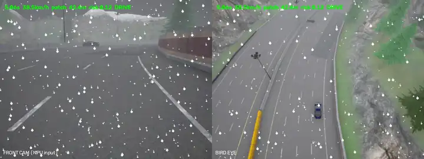</p>

<p align="center">
  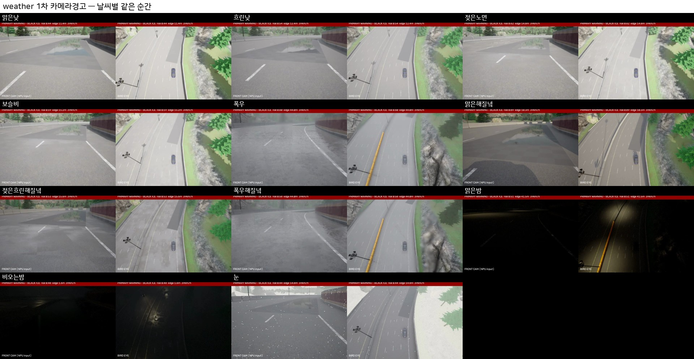
</p>

맑음 · 흐림 · 젖은 노면 · 보슬비 · 폭우 · 해질녘 · 밤 · 비 오는 밤 · 눈까지 같은 주행선에서 돌렸다.

### 1차 방어의 한계도 그대로 남긴다

<p align="center">
  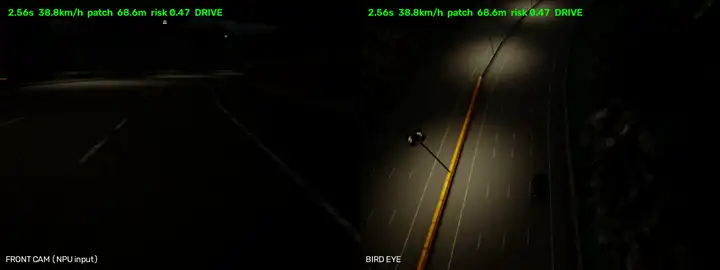
  <br>
  <sub>밤. 빙판이 41 m 밖에 있어 카메라 ROI(7.9~42.2 m)에 들어오지도 않았는데 경보가 났다. 어두운 노면을 얼음으로 본 것이다.</sub>
</p>

---

## 데이터 전략

1차와 2차는 필요한 데이터의 결이 다르다. **모델 헤드별 정답을 먼저 정의하고** 그에 맞는 공개 데이터셋을 매핑했다.

| 방어 | 필요 역할 | 필요한 정답 | 데이터셋 | 활용 |
|---|---|---|---|---|
| 🔵 1차 | 노면 상태 분류 | 건조/젖음/눈/결빙 클래스 | **RSCD** | 주 학습 |
| 🔵 1차 | 반사도·젖음 정도 | 실측 수막 두께 | **RoadSaW** | 반사도 헤드 근거 |
| 🔵 1차 | 국내 도로·악천후 | 눈·비·안개 + 조도 | **AI Hub** | 도메인 검증 |
| 🟠 2차 | IMU 미끄러짐 감지 | 실측 6축 IMU + 노면 라벨 | **PVS** | 칼만 필터 검증 |
| 🟠 2차 | 카메라–IMU 융합 | RGB-IMU 동기, 악조건 | **ROAD** | 비교 기준선 |
| ⚪ 보조 | 폭설 실주행 | 눈 장면·포인트 라벨 | **CADC · WADS** | 악천후 점검 |
| ⚪ 보조 | 차선 가시성 | 자동 라벨 | **CARLA** | 합성 데이터 생성 |

### RSCD — 노면 분류 주 학습 데이터

<p align="center">
  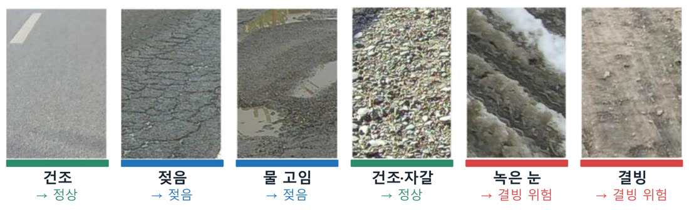
  <br>
  <sub>RSCD 27클래스를 우리 4클래스로 매핑한다. 건조→정상, 젖음·물고임→젖음, 결빙·녹은눈→결빙 위험, 요철 '심함'→포트홀</sub>
</p>

<table>
<tr>
<td width="50%">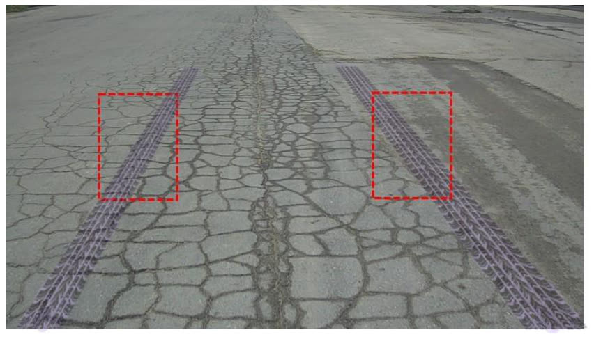</td>
<td width="50%">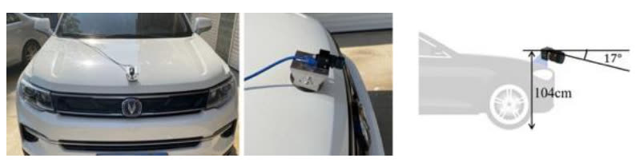</td>
</tr>
<tr>
<td align="center"><sub>주행 영상에서 노면 영역만 잘라 패치로 쓴다</sub></td>
<td align="center"><sub>차량 전방 카메라, 20~80 km/h 주행 촬영</sub></td>
</tr>
</table>

약 100만 장(공개 서브셋 37만 장), 27클래스 = 마찰 6 × 재질 4 × 요철 3. 240×360 패치라 NPU 입력 크기에 맞다. 베이징 약 700 km 실도로 주행. 눈·얼음은 결빙 57,262 · 녹은 눈 64,263 · 신설 76,730장이다.

### RoadSaW · AI Hub — 반사도 헤드와 국내 도로 검증

<table>
<tr>
<td width="50%">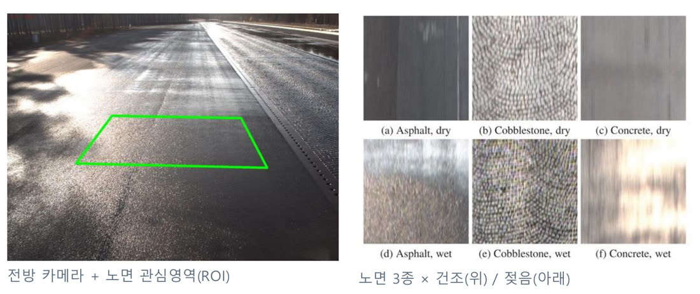</td>
<td width="50%">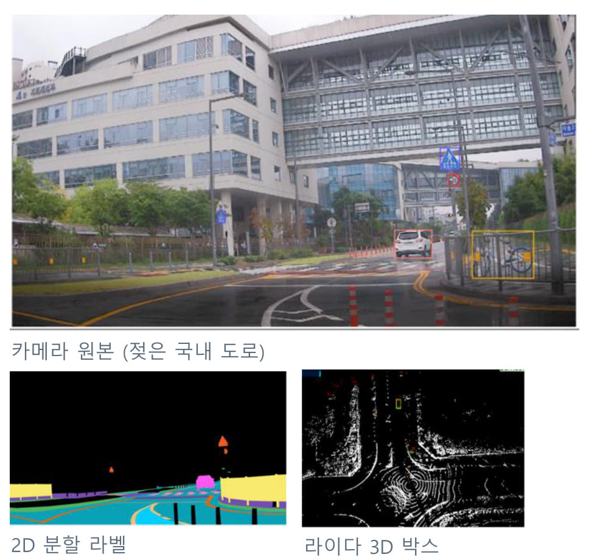</td>
</tr>
<tr>
<td align="center"><sub><b>RoadSaW</b> 12클래스 = 노면 3종 × 젖음 4단계. MARWIS 센서로 수막 두께를 실측해 반사도를 회귀로 배울 근거가 된다. 패치 약 72만 장</sub></td>
<td align="center"><sub><b>AI Hub</b> 승용 자율주행차 악천후 데이터. 카메라·라이다·레이더에 2D 분할 라벨과 3D 박스. 우리 라벨 내보내기 형식의 본보기</sub></td>
</tr>
</table>

### PVS · ROAD — 2차 방어 검증용 실측 신호

<table>
<tr>
<td width="50%">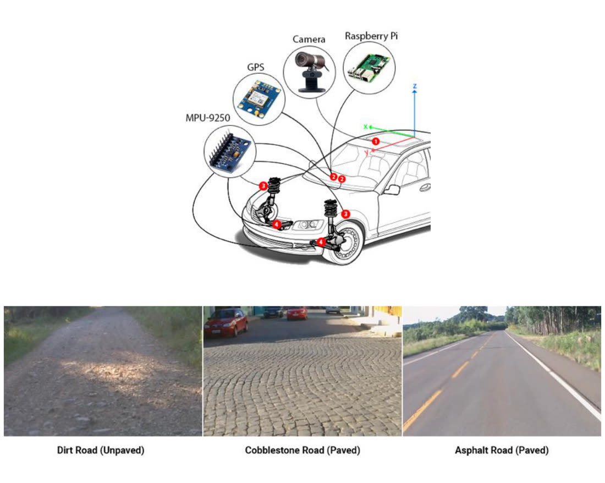</td>
<td width="50%">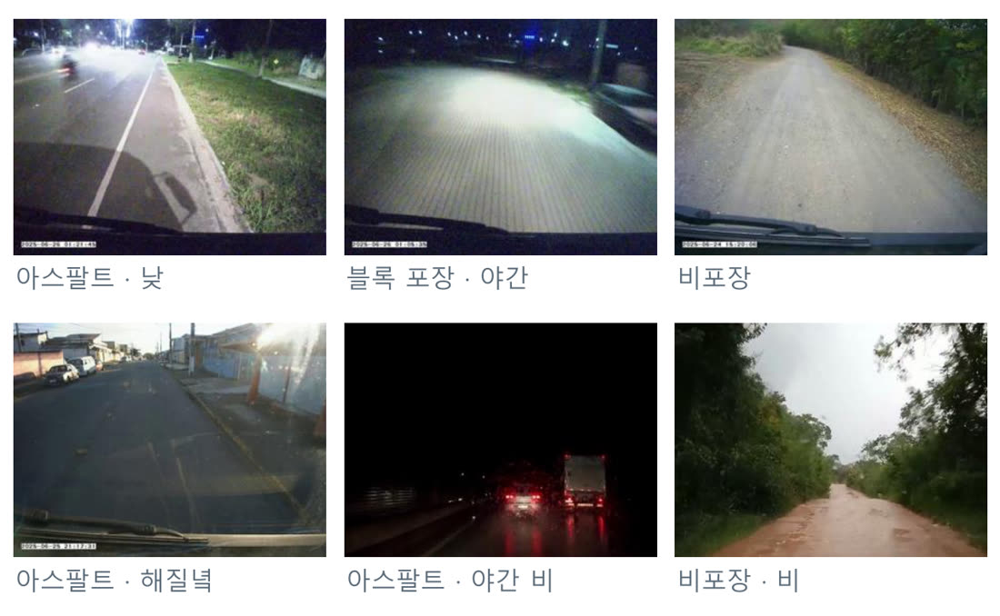</td>
</tr>
<tr>
<td align="center"><sub><b>PVS</b> MPU-9250 IMU 100 Hz를 대시보드·서스펜션 상/하 3곳에. 9세트 = 차량 3 × 운전자 3 × 경로 3. 실측 노이즈로 칼만 공분산을 잡는다</sub></td>
<td align="center"><sub><b>ROAD</b> 카메라 30 fps + IMU 5개 400 Hz 동기, 약 115만 프레임. 야간·폭우·먼지 악조건. 우리 이중 구조와 같은 논리</sub></td>
</tr>
</table>

### CADC · WADS — 폭설 실주행 점검

<table>
<tr>
<td width="50%">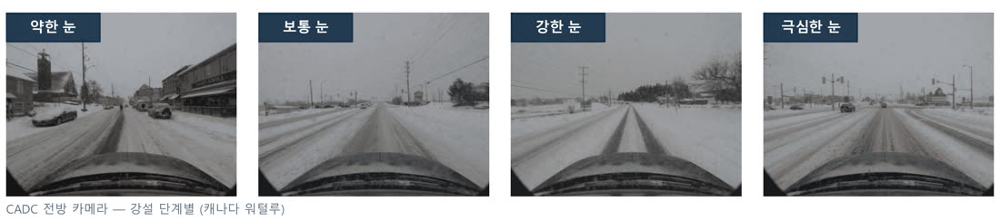</td>
<td width="50%">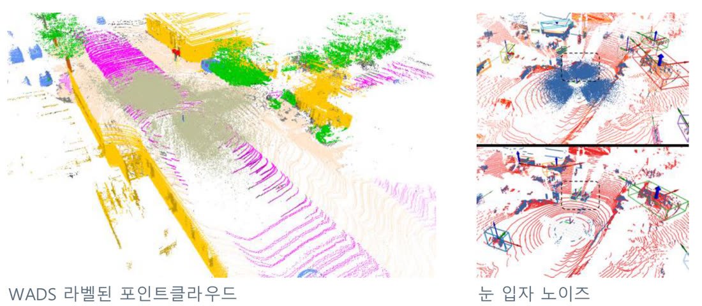</td>
</tr>
<tr>
<td align="center"><sub><b>CADC</b> 눈길 실주행 5.6만 장, 라이다 7천 스윕, 75개 장면 (캐나다 워털루)</sub></td>
<td align="center"><sub><b>WADS</b> 미시간 폭설 라이다. '내리는 눈 / 쌓인 눈'을 포인트별로 라벨 (36억 점). 우리 시맨틱 라이다 표현의 참고</sub></td>
</tr>
</table>

### 출처와 라이선스

위 데이터셋 그림은 각 공개 데이터셋의 논문·공식 사이트에서 가져온 것이며, 설명 목적의 비상업적 인용이다.

| 데이터셋 | 출처 | 라이선스 |
|---|---|---|
| RSCD | thu-rsxd.com/rscd · Zhao et al., *Data in Brief* (2022) | CC BY |
| RoadSaW | viscoda.com · CVPRW 2022 | CC BY-NC-SA 4.0 |
| AI Hub | 승용 자율주행차 악천후 데이터 (71626) | AI Hub 이용약관 |
| PVS | github.com/jefmenegazzo | CC BY-NC-ND 4.0 |
| ROAD | arXiv 2601.20847 | 논문 명시 조건 |
| CADC | cadcd.uwaterloo.ca · arXiv 2001.10117 | CC BY-NC-SA |
| WADS | digitalcommons.mtu.edu/wads · arXiv 2109.07078 | 논문 명시 조건 |

하드웨어 사진은 팀이 직접 촬영했다.

> **⚠️ 냉정한 한계.** 공개 데이터에 '블랙아이스' 라벨은 없다. RSCD의 `ice` 5.7만 장도 다져진 눈·서리에 가까운 '얼음 노면'일 뿐, 투명한 블랙아이스를 따로 구분하지 않는다. 그래서 1차는 블랙아이스를 직접 맞히려 하지 않고 **결빙 위험 노면 확률 + 반사도 이상 + 기상 맥락**으로 위험도를 올린다. 그리고 그 전략이 실패할 때를 위해 2차가 있다.

---

## 파라미터

### 1차 방어 — 모델과 배포

| 항목 | 값 |
|---|---|
| 백본 | MobileNetV3-Small (ImageNet 사전학습) |
| 입력 | 1×3×224×224 NCHW, int8 |
| 출력 | 4클래스 로짓 + 반사도 헤드 (576→64→1) |
| 내보내기 | ONNX opset 13, 고정 배치 1 |
| 양자화 | int8 PTQ (QDQ), 가중치 채널별, 활성 대칭 |
| 입력 양자화 | scale 0.018658448, zero-point −14 |
| 출력 양자화 | scale 0.029451849 |
| 프레임당 전송 | 150,528 B |
| NPU | Neural-ART @ 1 GHz · 추론 25 ms |
| ROI | 차량 전방 7.9~42.2 m (카메라 FOV 60°, 피치 −12°) |

### 위험도 융합 — risk = α·p_ice + β·반사도 + γ·(1−차선가시성)

| 기상·위치 맥락 | α (분류) | β (반사도) | γ (차선) |
|---|---:|---:|---:|
| 교량·새벽 등 결빙 위험 높음 | 0.35 | 0.45 | 0.20 |
| 일반 | 0.50 | 0.30 | 0.20 |
| 저위험 | 0.55 | 0.15 | 0.30 |

운영 문턱 **0.603** (실사진 69,358장 스윕으로 결정). 사용할 수 없는 신호는 0을 넣지 않고 **분모에서 빼서 재정규화**한다. 0은 중립값이 아니라 최솟값이라 위험도 상한이 잘리기 때문이다.

### 2차 방어 — 미끄러짐 감지

| 항목 | 값 | 비고 |
|---|---|---|
| 축거 L | 2.7 m | 자전거 모델 |
| 특성속도 v_ch | 17 m/s | 고속 언더스티어 보정 `1/(1+(v/v_ch)²)` |
| 조향 지연 τ | 0.06 s | 급조향 시 모델 즉답 가정이 오탐을 만들어 추가 |
| 횡가속 임계 | 0.30 g | |
| yaw 오차 임계 | 0.35 rad/s | |
| 판정 규칙 | **타원** | 직사각형은 모서리에서 저속 지연이 생겼다 |
| 확정 샘플 | 3 (60 ms @ 50 Hz) | |
| 저마찰 트리거 | 제동 ≥ 0.3이 0.3 s 지속 + 감속 < 1.2 m/s² | 필터 지연 구간 오탐 방지 |
| 필터 | 2상태 칼만 (값·변화율), Q=2000/3000, R=0.16/0.0005 | |

### 2차 방어 — 비상 제어

| 항목 | 값 |
|---|---|
| 조향 Kp (방향 오차) | 1.4 |
| 조향 Kl (차선 횡오프셋) | 0.15 |
| 조향 Kd (yaw rate) | 0.30 |
| 조향 한계 | ±0.5 (정규화) |
| 제동 펄스 (ABS 흉내) | 0.70 ↔ 0.35, 약 3 Hz |
| 빙판 감속 가정 | 1.0 m/s² |
| 접지 회복 판정 | 감속 2.5 m/s² 이상이 5샘플 → 마른 노면 6.0 m/s² 적용 |
| 빈 차로 기준 | 앞차 간격 20 m 이상 |
| 차로 폭 | 3.5 m |
| 제어 모드 | 차선유지 / 좌·우 회피 / 최대 제동 / 정지 |

### HIL 시뮬레이션 설정

| 항목 | 값 |
|---|---|
| 맵 · 모드 | CARLA Town04, 동기 모드 50 Hz |
| 빙판 | 마찰 트리거 0.02 (저마찰 시나리오 0.08), 길이 40 m / 100 m |
| 타이어 마찰 | 1.0 (CARLA 기본 3.5는 비현실적이라 바꿨다) |
| 주행 속도 | 40 km/h 기본, 60 km/h 고속 시나리오 |
| 주변 차량 | 8대 자율주행 + 정차 차량 1대 |
| 날씨 | CARLA 프리셋 10종 + 직접 구현한 `Snow` |
| 시점 | 1인칭+조감 / 조감 / 라이다 3D / 시맨틱 라이다 |

---

## 근거 문서

모든 숫자는 **실측에서 자동 생성**된다. 손으로 적은 값이 아니므로 생성기를 다시 돌리면 갱신된다.

| 문서 | 답하는 질문 | 생성기 |
|---|---|---|
| [00_집계](docs/evidence/00_집계.md) | 주행 전체 표 (충돌·스핀·이탈 포함) | `summarize_runs.py` |
| [01_탐지성능](docs/evidence/01_탐지성능.md) | 경보 거리, 오경보, 보드 WCET | `analyze_detection.py` |
| [05_실사진_대규모평가](docs/evidence/05_실사진_대규모평가.md) | ★ 1차 방어 성능의 근거 | `rscd_board_eval.py` |
| [06_RTOS가_왜_필요한가](docs/evidence/06_RTOS가_왜_필요한가.md) | ★ 왜 RTOS 보드인가 | `rtos_latency_bench.py` |
| [10_스케줄가능성_분석](docs/evidence/10_스케줄가능성_분석.md) | ★ RM 스케줄, 우선순위 역전 시 왜 불가능한가 | `schedulability.py` |
| [13_판정규칙_타원](docs/evidence/13_판정규칙_타원.md) | ★ 약점을 찾아 고친 기록 | `slip_rule_compare.py` |
| [16_조향지연보정](docs/evidence/16_조향지연보정.md) | ★ 2차가 정상 노면에서 발화한 것을 고친 기록 | `yawlag_report.py` |
| [17_경보거리와_해상도](docs/evidence/17_경보거리와_해상도.md) | ★ 경보 거리를 늘리려면 무엇을 바꿔야 하나 | `range_resolution.py` |

전체 목록은 [`00_분석문서_목록`](docs/evidence/00_분석문서_목록.md), 발표용 자료 지도는 [`presentation_evidence_map`](docs/presentation_evidence_map.md)에 있다.

---

## 저장소 구조

```
src/icepredict/        파이썬 패키지
  common/              Pi ↔ N6 ↔ CARLA 메시지 규약
  pi/                  기상 맥락, 위험도 융합, IMU 미끄러짐 감지(C 이식 원본)
  sim/                 CARLA 빙판 합성, 카메라 설정, 차로 추종
  train/               RoadNet 모델, 데이터 인덱스
fw/npu_lib/            STM32N6 펌웨어 글루
  slip_core.h          2차 방어 C 코어 (HAL·OS 비의존, 호스트에서도 컴파일)
  npu_infer.c          Neural-ART NPU 추론
  patch_fw_slip.py     ThreadX 융합 스레드에 2차 방어 주입
scripts/               → scripts/README.md 에 입구 목록
  sim/                 CARLA 수집 · 데모 · 영상 정리
  model/               RoadNet 학습 · int8 양자화 · 반사도 헤드
  deploy/              STM32N6 적재 · 브리지 · 보드 평가
  analysis/            집계 · 그림 · 근거 문서 생성
  archive/             일회성 배치 체인 (재현 이력 보존)
docs/evidence/         자동 생성 근거 문서 19개
docs/figures/          결과 그림 28장
docs/images/           하드웨어·데이터셋 사진
docs/data/events/      주행 이벤트 107건 (분석 재현용)
media/                 README 애니메이션 + 영상
```

---

## 재현

**CARLA도 보드도 없이 분석만 재현**하려면 저장소의 이벤트 데이터만 있으면 된다.

```bash
pip install -e .
python3 scripts/analysis/summarize_runs.py        # docs/evidence/00_집계.md 재생성
python3 -m pytest -q                     # 단위 테스트
```

2차 방어 C 코어가 파이썬 참조 구현과 **같은 판정을 내리는지** 호스트에서 검증한다.

```bash
python3 fw/npu_lib/test_slip_core.py     # gcc 로 C 코어를 빌드해 동치 비교
```

전체 파이프라인(수집 → 학습 → int8 양자화 → 보드 배포 → HIL 데모)은 [`demo_pipeline`](docs/demo_pipeline_2026-09-19.md)에 있다.

---

## 한계

- **블랙아이스 전용 라벨이 공개 데이터에 없다.** 그래서 1차는 '결빙 위험 노면 확률 + 반사도 이상 + 기상 맥락' 전략을 쓴다.
- **경보 거리는 기하 문제다.** 모델이 요구하는 최소 픽셀 수와 ROI 해상도가 경보 거리를 결정한다. 해상도를 올리는 것이 먼저다 ([17번 문서](docs/evidence/17_경보거리와_해상도.md)).
- **CARLA 질감으로 학습한 모델은 실사진 질감의 얼음에 반응하지 않는다.** 재수집·재학습이 다음 과제다.
- 1차 방어 영상 중 일부는 렌더 품질이 다른 환경에서 찍혔다. 비교할 때 주의가 필요하다.
- 기준선은 제어 상실 후 운전자 입력을 모형화하지 않는다. 실제 운전자는 제동을 시도하므로, 기준선의 결과는 "아무 보조도 없을 때의 물리적 귀결"로 읽어야 한다.

---

## 라이선스

코드와 팀이 생성한 자료(분석 문서·그림·이벤트 데이터·영상·하드웨어 사진)는 [MIT 라이선스](LICENSE)를 따른다.
`docs/images/ds_*.jpg` 는 공개 데이터셋 논문·사이트에서 가져온 설명용 인용이며 각 원 저작자의 조건을 따른다 ([NOTICE](NOTICE) 참고).

---

## 팀

**팀 ARTS** · 이지성 · 남윤상 · 김진찬
제24회 임베디드SW경진대회 자동차/모빌리티 부문 (현대자동차)
