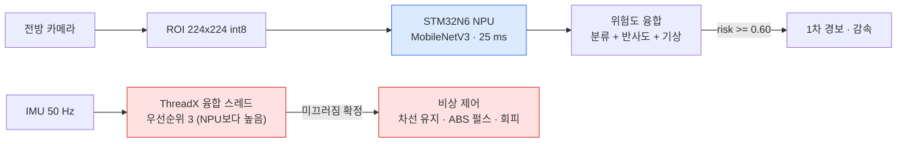
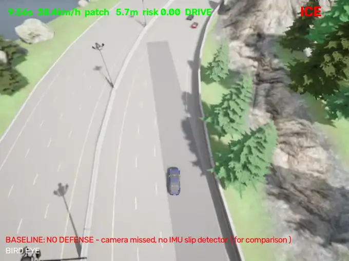

# IcePredict — AI 예측과 RTOS 반응의 이중 안전망 블랙아이스 대응 시스템

**AI가 노면을 미리 보고, 못 보더라도 RTOS가 차량 거동으로 확실히 잡는다.**

제24회 임베디드SW경진대회 · 자동차/모빌리티(현대자동차) · 팀 ARTS

<p align="center">
  
  <br>
  <sub><b>왼쪽</b> 방어가 없을 때 — 빙판에서 제어를 잃고 스핀한다. &nbsp;·&nbsp; <b>오른쪽</b> STM32N6 RTOS 2차 방어 — 미끄러짐을 잡아 차선 안에서 세운다. 같은 날씨, 같은 주행선, 같은 빙판.</sub>
</p>

---

## 왜 이중 방어인가

블랙아이스는 **공개 데이터에 라벨이 없다.** 투명한 얼음은 아스팔트와 시각적으로 구분되지 않는다는 것이 업계 통설이고, 실제로 우리 모델도 실사진 얼음 6,340장 중 248장(3.9 %)을 놓친다. 놓친 사진의 얼음 확률은 0.00~0.48이라 문턱을 낮춰도 잡히지 않는다.

그래서 카메라 하나에 기대지 않는다.

| | 1차 방어 · 예측 | 2차 방어 · 반응 |
|---|---|---|
| 센서 | 전방 카메라 | IMU (횡가속 · yaw rate · 종가속) |
| 판단 | 노면 4분류 + 반사도 + 기상 맥락 → 위험도 | 칼만 필터 + 자전거 모델 잔차 → 미끄러짐 확정 |
| 시점 | 빙판에 닿기 **전** | 미끄러지기 **시작한 뒤** |
| 성격 | 똑똑하지만 틀릴 수 있다 | 단순하지만 제때 반드시 실행된다 |
| 실행 | STM32N6 NPU (25 ms) | STM32N6 + ThreadX (최악 22.6 µs) |

두 방어가 **같은 보드 한 장**에서 돈다. 혼합 임계도 AI ECU 구조다.



---

## 1차 방어 — 카메라가 보고 미리 선다

<p align="center">
  
  <br>
  <sub>왼쪽은 모델이 실제로 보는 화면, 오른쪽은 조감. 빙판 24 m 앞에서 정지했다.</sub>
</p>

성능은 시뮬레이션 화면이 아니라 **실제 도로 사진 69,358장을 보드에 직접 넣어** 쟀다.

| 실제 노면 | 장수 | 정답률 | 경보율 (문턱 0.603) |
|---|---:|---:|---:|
| 블랙아이스 | 6,340 | **96.1 %** | **96.6 %** |
| 마른 노면 | 19,018 | 80.7 % | 0.3 % |
| 젖은 노면 | 34,440 | 84.6 % | 0.8 % |
| 포트홀 | 9,560 | 90.2 % | 0.3 % |

<p align="center">
  
  
</p>

→ 근거: [`docs/evidence/05_실사진_대규모평가.md`](docs/evidence/05_실사진_대규모평가.md) · [`02_융합가중치.md`](docs/evidence/02_융합가중치.md) · [`07_노면조건별_분해.md`](docs/evidence/07_노면조건별_분해.md)

---

## 2차 방어 — 못 봤을 때 보드가 받는다

<p align="center">
  
  <br>
  <sub>1차를 끈 채 빙판에 진입했다. 보드가 미끄러짐을 확정하고 차선을 유지하며 세운다. 주변 차량 8대와 정차 차량이 있는 상황.</sub>
</p>

**왜 리눅스가 아니라 RTOS인가.** 속도가 아니라 **꼬리**가 쟁점이다. 같은 연산을 Pi 5 리눅스가 평균 146배 빠르게 하지만, 최악 깨어남 지연이 5,790 µs다. 제어 주기 20 ms의 29 %를 한 번의 지터가 먹는다.

| 플랫폼 | 표본 | 중앙값 | 최악 |
|---|---:|---:|---:|
| Pi 5 + Linux · 유휴 | 20,000 | 69 µs | **5,790 µs** |
| Pi 5 + Linux · 부하 | 20,000 | 68 µs | **5,429 µs** |
| STM32N6 + ThreadX (응답 전체) | 49,405 | 12.4 µs | **22.6 µs** |

<p align="center">
  
</p>

→ 근거: [`docs/evidence/06_RTOS가_왜_필요한가.md`](docs/evidence/06_RTOS가_왜_필요한가.md) · [`10_스케줄가능성_분석.md`](docs/evidence/10_스케줄가능성_분석.md)

---

## 방어가 없으면

<p align="center">
  
  <br>
  <sub>같은 빙판, 같은 속도. 1차·2차를 모두 끄면 차선을 벗어나 역방향으로 스핀한다.</sub>
</p>

기준선 주행에서 충돌 8회, 스핀 5회, 차선 이탈 11회가 기록됐다. 이 숫자가 2차 방어의 존재 이유다.

> **정직하게 적는다.** 2차 방어가 모든 것을 막지는 못한다. 60 km/h 주행에서는 보드가 제때 개입했는데도 앞차와 39 km/h로 충돌했다. 2차 방어는 예방이 아니라 피해 최소화다. 그래서 1차가 필요하다.

---

## 센서 시각화

<p align="center">
  
  <br>
  <sub>시맨틱 라이다 64채널. 청록이 빙판 구간, 초록 상자가 차량 3D 박스.</sub>
</p>

<p align="center">
  
  <br>
  <sub>카메라 원본 · 2D 분할 라벨(도로/차선/빙판/차량) · 시맨틱 라이다. 라벨은 자동 생성한다.</sub>
</p>

<details>
<summary><b>날씨 11종에서 같은 순간 (펼치기)</b></summary>

<p align="center"></p>

<p align="center">
  
</p>

맑음 · 흐림 · 젖은 노면 · 보슬비 · 폭우 · 해질녘 · 밤 · 비 오는 밤 · 눈까지 같은 주행선에서 돌렸다.
</details>

---

## 근거 문서

모든 숫자는 **실측에서 자동 생성**된다. 손으로 적은 값이 아니므로 생성기를 다시 돌리면 갱신된다.

| 문서 | 답하는 질문 | 생성기 |
|---|---|---|
| [00_집계](docs/evidence/00_집계.md) | 주행 전체 표 (충돌·스핀·이탈 포함) | `summarize_runs.py` |
| [01_탐지성능](docs/evidence/01_탐지성능.md) | 경보 거리, 오경보, 보드 WCET | `analyze_detection.py` |
| [05_실사진_대규모평가](docs/evidence/05_실사진_대규모평가.md) | ★ 1차 방어 성능의 근거 | `rscd_board_eval.py` |
| [06_RTOS가_왜_필요한가](docs/evidence/06_RTOS가_왜_필요한가.md) | ★ 왜 RTOS 보드인가 | `rtos_latency_bench.py` |
| [10_스케줄가능성_분석](docs/evidence/10_스케줄가능성_분석.md) | ★ RM 스케줄, 우선순위 역전 시 왜 불가능한가 | `schedulability.py` |
| [13_판정규칙_타원](docs/evidence/13_판정규칙_타원.md) | ★ 약점을 찾아 고친 기록 | `slip_rule_compare.py` |
| [16_조향지연보정](docs/evidence/16_조향지연보정.md) | ★ 2차가 정상 노면에서 발화한 것을 고친 기록 | `yawlag_report.py` |
| [17_경보거리와_해상도](docs/evidence/17_경보거리와_해상도.md) | ★ 경보 거리를 늘리려면 무엇을 바꿔야 하나 | `range_resolution.py` |

전체 목록은 [`docs/evidence/00_분석문서_목록.md`](docs/evidence/00_분석문서_목록.md), 발표용 자료 지도는 [`docs/presentation_evidence_map.md`](docs/presentation_evidence_map.md)에 있다.

---

## 구조

```
src/icepredict/        파이썬 패키지
  common/              Pi ↔ N6 ↔ CARLA 메시지 규약
  pi/                  기상 맥락, 위험도 융합, IMU 미끄러짐 감지(C 이식 원본)
  sim/                 CARLA 빙판 합성, 카메라 설정, 차로 추종
  train/               RoadNet 모델, 데이터 인덱스
fw/npu_lib/            STM32N6 펌웨어 글루
  slip_core.h          2차 방어 C 코어 (HAL·OS 비의존, 호스트에서도 컴파일)
  npu_infer.c          Neural-ART NPU 추론
  patch_fw_slip.py     ThreadX 융합 스레드에 2차 방어 주입
scripts/               수집 · 학습 · 양자화 · 배포 · 데모 · 분석
docs/evidence/         자동 생성 근거 문서 19개
docs/figures/          그림 28장
docs/data/events/      주행 이벤트 107건 (분석 재현용)
media/                 README 애니메이션 + 영상
```

---

## 재현

**CARLA도 보드도 없이 분석만 재현**하려면 저장소의 이벤트 데이터만 있으면 된다.

```bash
pip install -e .
python3 scripts/summarize_runs.py        # docs/evidence/00_집계.md 재생성
python3 -m pytest -q                     # 단위 테스트
```

2차 방어 C 코어가 파이썬 참조 구현과 **같은 판정을 내리는지** 호스트에서 검증한다.

```bash
python3 fw/npu_lib/test_slip_core.py     # gcc 로 C 코어를 빌드해 동치 비교
```

전체 파이프라인(수집 → 학습 → int8 양자화 → 보드 배포 → HIL 데모)은 [`docs/demo_pipeline_2026-09-19.md`](docs/demo_pipeline_2026-09-19.md)에 있다.

---

## 하드웨어

| 구성 | 역할 |
|---|---|
| STM32N6570-DK | 1차 NPU 추론 + 2차 ThreadX 실시간 판정·제어 |
| Raspberry Pi 5 (16 GB) + AI HAT+ 2 (Hailo-10H) | 호스트, 기상 맥락, 통신 브리지 |
| RTX 5090 워크스테이션 | CARLA 시뮬레이션 (HIL 환경) |

실물 빙판 노면을 만드는 1/5 차량 실측이 현실적으로 어려워, **실물 보드가 실제 펌웨어를 돌리고 CARLA가 센서와 물리를 제공하는 HIL 검증**으로 대체했다. 실물 데이터는 RSCD 실사진 69,358장을 보드에 직접 넣는 방식으로 보강했다.

---

## 한계

- **블랙아이스 전용 라벨이 공개 데이터에 없다.** RSCD의 `ice`는 다져진 눈·서리에 가깝고 투명한 블랙아이스와 다르다. 그래서 1차는 '결빙 위험 노면 확률 + 반사도 이상 + 기상 맥락'으로 위험도를 올리는 전략을 쓴다.
- **경보 거리는 기하 문제다.** 모델 입력이 요구하는 최소 픽셀 수와 ROI 해상도가 경보 거리를 결정한다. 해상도를 올리는 것이 먼저다 ([`17번 문서`](docs/evidence/17_경보거리와_해상도.md)).
- **CARLA 질감으로 학습한 모델은 실사진 질감의 얼음에 반응하지 않는다.** 재수집·재학습이 다음 과제다.
- 1차 방어 영상 중 일부는 렌더 품질이 다른 환경에서 찍혔다. 비교할 때 주의가 필요하다.

---

## 팀

**팀 ARTS** · 이지성 · 남윤상 · 김진찬
제24회 임베디드SW경진대회 자동차/모빌리티 부문 (현대자동차)
