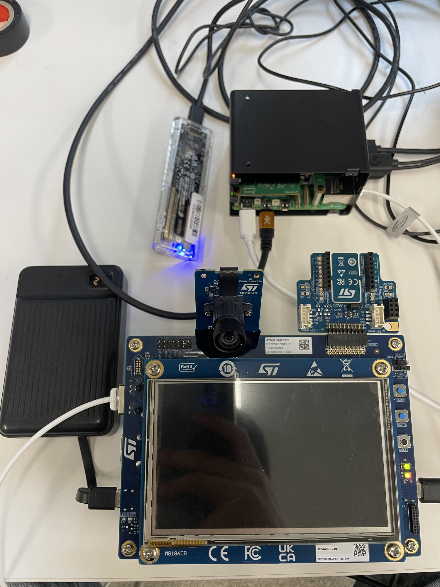

# hw — 하드웨어

<p align="center">
  
</p>

## 구성

| 구분 | 정식 명칭 | 하는 일 |
|---|---|---|
| 메인 보드 | **STM32N6570-DK** (STM32N657X0H3Q) | 1차 NPU 추론과 2차 ThreadX 실시간 판정을 **한 보드에서** 돌린다 |
| └ 캐리어 | MB1939-N6570-C02 | 디스커버리 키트 본체 |
| └ 디스플레이 | MB1860B (RK050HR18C 5인치 터치) | 보드 자체 상태 표시 |
| 카메라 | **ST AI Camera module MB1854B** | 1차 방어 입력. 보드에 직결되어 NPU 로 바로 들어간다 |
| 호스트 | **Raspberry Pi 5 16 GB + AI HAT+ 2 (Hailo-10H)** | 기상 맥락 생성, ZMQ 브리지, 교차 검증용 NPU. 대회 필수 보드 |
| 저장장치 | **NVMe 1 TB SSD + USB 외장 케이스** | 데이터셋과 주행 로그. 파이를 껐다 켜도 남는다 |
| 전원 | **보조배터리 (휴대형 파워뱅크)** | 콘센트 없이 차량·야외에서 같은 구성을 돌리기 위한 것 |
| 센서 | **Intel RealSense D435i** | RGB · 뎁스 · IMU. 실측 노이즈 특성 확보용 |
| 렌더 머신 | RTX 5090 워크스테이션 | CARLA 0.9.16 — HIL 환경의 물리·센서 제공 |
| 조작 장치 | **Moza 포스피드백 휠 + 페달** | 사람이 직접 CARLA 를 운전하는 경로 |

## 신호 흐름

```
[ST AI 카메라 MB1854B] ──직결──> [STM32N6570-DK]
                                    ├─ NPU(Neural-ART)  1차: 노면 4분류 + 반사도 → 위험도
                                    └─ ThreadX          2차: IMU 미끄러짐 확정 → 비상 제어
                                         ▲                        │
                                  IMU 50 Hz / 제어 명령           │
                                         │                        ▼
[RTX 5090 · CARLA] <──ZMQ──> [Raspberry Pi 5 브리지] <────────────┘
         ▲
         └── [Moza 휠·페달]  사람이 직접 운전할 때
```

ZMQ 는 **데스크톱이 bind, 파이가 connect** 한다. 캠퍼스 망이 유선→무선 방향을 막아 반대로는 붙지 않는다.

## 사진

| 파일 | 내용 |
|---|---|
| [`images/hw_n6_bench.jpg`](images/hw_n6_bench.jpg) | STM32N6570-DK + AI 카메라 + Pi 5 + SSD + 보조배터리 전체 구성 |
| [`images/hw_moza_rig.jpg`](images/hw_moza_rig.jpg) | Moza 휠·페달로 CARLA 를 직접 운전하는 모습 |
| [`images/hw_pi_stack.jpg`](images/hw_pi_stack.jpg) | Pi 5 + AI HAT+ 2 스택, KKSB 케이스·액티브 쿨러 |
| [`images/hw_d435i_nvme.jpg`](images/hw_d435i_nvme.jpg) | RealSense D435i 와 NVMe 외장 |
| [`images/hw_boot.jpg`](images/hw_boot.jpg) | Raspberry Pi OS 부팅·브링업 확인 |

## 펌웨어를 다시 굽는 방법

SWD 로 적재하며 **BOOT1 스위치 조작이 필요해 보드에 물리적으로 접근해야 한다.** 파이나 렌더 머신에는 툴체인이 없다.

```bash
bash sw/scripts/deploy/n6_swd_free.sh     # 남아 있는 gdbserver 가 SWD 를 잡고 있으면 푼다
bash sw/scripts/deploy/n6_fw_load.sh      # 적재
```

펌웨어 글루 코드는 [`sw/fw/npu_lib/`](../sw/fw/npu_lib) 에 있다.
